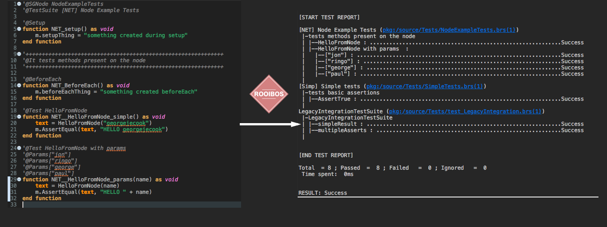

  

<h3 align="center">
Simple, mocha-and junit inspired, flexible, fun Brightscript test framework for ROKU apps
</h3>

  

## Links
 - **[Documentation](https://github.com/georgejecook/rooibos/blob/master/docs/index.md)**
 - **[API Documentation](https://georgejecook.github.io/rooibos)**
 - **[CHANGELOG](CHANGELOG.md)**
 - **[VSCode snippets](docs/vsCodeSnippets.md)**
 - \#roku channel on the [roku developer's slack](https://join.slack.com/t/rokudevelopers/shared_invite/enQtMzgyODg0ODY0NDM5LTc2ZDdhZWI2MDBmYjcwYTk5MmE1MTYwMTA2NGVjZmJiNWM4ZWY2MjY1MDY0MmViNmQ1ZWRmMWUzYTVhNzJiY2M)

## Development

Rooibos is an independent open-source project, maintained exclusively by volunteers.

You might want to help! Get in touch via the slack group, or raise issues.

## Sample project
https://github.com/georgejecook/rooibos-roku-sample

## Quick start
https://github.com/georgejecook/rooibos/blob/master/docs/index.md#getting-started

## FAQ
### Is Rooibos ready for production use?

Yes, it's been used in production by quite a few folks, I'll provide a list in due-course; but there are 10'000's of tests in production in some very respectable companies.

### Is Rooibos actively maintained?

I love rooibos, and always keep it up to date. I use it all the time.
