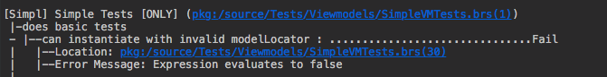
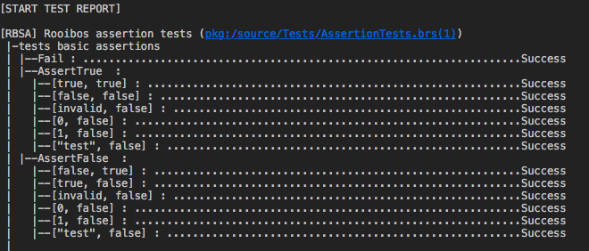
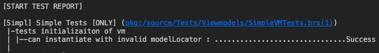
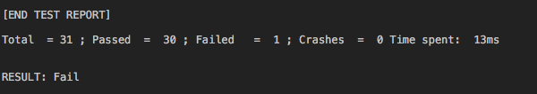
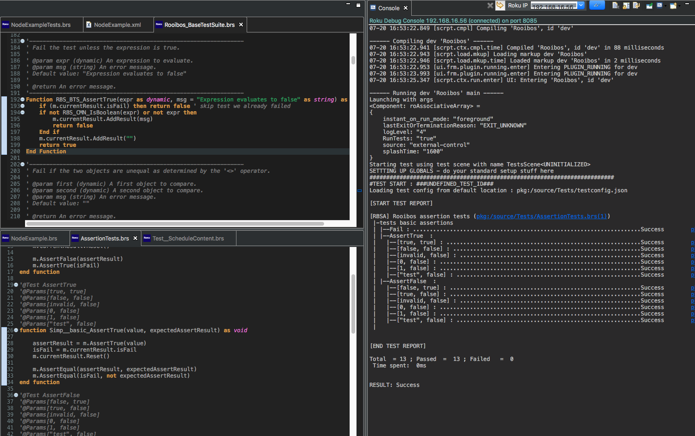
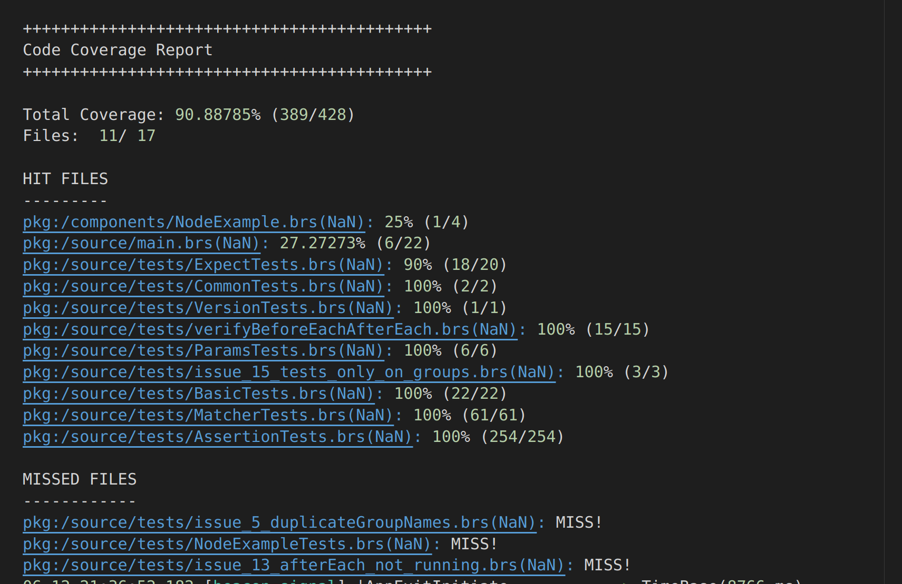
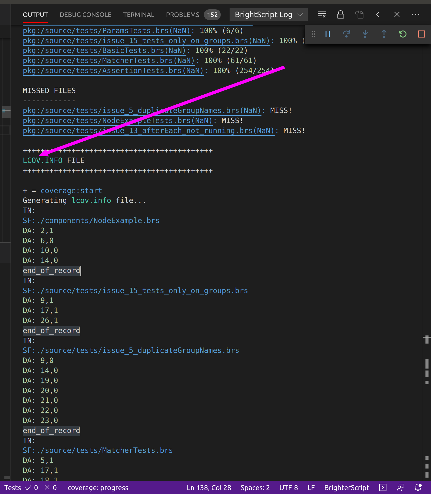

<p align="center">
  
</p>
<h3 align="center">
Simple, mocha-inspired, flexible, fun Brightscript test framework for ROKU apps
</h3>


## FEATURES
 - [Easy to integrate](#easy-to-integrate)
 - [Simple, annotation-based, syntax for writing tests](#simple-syntax-for-writing-tests)
 - [No need for special file names, or method names](#no-need-for-special-file-or-method-names)
 - [Common TDD methods such as Setup/TearDown/BeforeEach/AfterEach](#common-tdd-methods)
 - [Organize tests by suites, groups and cases](#organize-tests-by-suites-groups-and-cases)
 - [Readable test output](#readable-test-output)
 - [Easily control test execution](#easily-control-test-execution)
 - [Simple assert syntax](#simple-assert-syntax)
 - [Node specific assertions](#node-specific-assertions)
 - [Parameterized testing](#parameterized-testing)
 - [Mocks and stubs](#mocks-and-stubs)
 - [Mocks node](#mocks-node)
 - [Execute tests on scenegraph nodes](#execute-tests-on-scenegraph-nodes)
 - [Incorporate your own util methods](#incorporate-your-own-util-methods)
 - [Hook into your global setup mechanisms](#hook-into-your-global-setup-mechanisms)
 - [Only show output for failed tests](#only-show-output-for-failed-tests)
 - [Easily integrate into any CI system](#easily-integrate-into-any-ci-system)
 - [Generate code coverage](#generate-code-coverage)


## TABLE OF CONTENTS
 - [Getting started](#getting-started)
 - [Creating test suites](#creating-test-suites)
 - [Writing tests](#writing-tests)
 - [Understanding test output](#understanding-test-output)
 - [Controlling which tests run](#controlling-which-tests-run)
 - [Integrating with your app setup and util methods](#integrating-with-your-app-and-utils)
 - [Using mocks and stubs](#using-mocks-and-stubs)
 - [API reference](https://georgejecook.github.io/rooibos)
 - [assertion reference](https://georgejecook.github.io/rooibos/module-BaseTestSuite.html)
 - [Integrating with your CI](#integrating-with-your-ci)
 - [Advanced Setup](#advanced-setup)
 - [Code coverage](#generate-code-coverage)

## Getting started
Rooibos is a brighterscript compiler and Visual Studio Extension plugin. That does not mean you need to write in brighterscript; the bsc compiler also parses regular brightscript projects.

The advantages of this are:

 - you get warnings and errors for your tests as you write them in the ide.
 - you do not have to install any thing in your projects, or maintain the rooibos libraries; it just works
 - it is very easy to integrate into your CI toolchain.

## Your project MUST use Vscode and the brighterscript compiler

Rooibos will not work if you do not use the brighterscript compiler. I have no plans to support any other toolchains.

### Installation
<a name="easy-to-integrate"></a>

1. ensure you have a bsconfig.json, as per: https://github.com/rokucommunity/brighterscript
1. `npm install rooibos-roku --save-dev`
1. Add the rooibos plugin to your `bsconfig.json` file as follows:

```
  "plugins": [
    "rooibos-roku"
  ]
```

Rooibos will automatically inject the necessary source files into your project, at build time, and inject the hooks to run.

Note - you will likely use a seprate `bsconfig.json` file for your tests, e.g. `bsconfig-test.json`, which will be used by your CI/testing vscode launch target.

#### Delaying start so you can set things up - CURRENTLY UNSUPPORTED

If you need to do some setup, like load some data from a service, before starting your tests:

 - add a field `isReadyToStartTests` to your tests scene
 - set the value to true, when the tests are ready to start.

 NOTE: this is not yet supported in rooibos 4! I will add it again soon.

### Configuring Rooibos's runtime behaviour

Rooibos's configuration is controlled via the configuration passed into the `bsconfig.json` via flags on the `rooibos` json blob

e.g.

```
  "rooibos": {
    "isRecordingCodeCoverage": false,
    "printTestTimes": true,
    "testsFilePattern": null,
    "tags": ["!integration", "!deprecated", "!fixme"],
    "showOnlyFailures": true,
    "catchCrashes": true,
    "lineWidth": 70
  },
  ```

The following options are supported:

- logLevel?: RooibosLogLevel - 0-4 (error, warn, info, debug)
- showOnlyFailures?: boolean - if true, then only failed tests are shown; but everything is show if no failures occurred
- printTestTimes?: boolean - if true then the time each test took is output
- lineWidth?: number - width of test output lines in columns
- catchCrashes? : boolean - if true, then any crashes will report CRASH statement, and note halt test execuction - very useful for running a whole suite
- testsFilePattern?: string - the pattern to use to find tests, this is a glob, the defawult is "**/*.spec.bs"
- tags?: string[] - the tags listed here control what is run - you can use !tagname to indicated any tests/suites that are skipped, all other tags are ANDed. This is very useful for having a bsconfig to run, say tests including long, and slow integration tests, or just running a certain subset of your suite.

## Creating test suites
<a name="organize-tests-by-suites-groups-and-cases"></a>

Rooibos has a hiearchy of tests as follows:

 - Suite
	 - Describe block
		 - it test
			 - Parameterized it test


Test suites are defined by:
 - declaring a class _inside_ a namespace
 - which extends `Rooibos.BaseTestSuite`
 - and has a `@suite` annotation

No special file naming is required. I recommend you call your files `thing.spec.bs` <a name="no-need-for-special-file-or-method-names"></a>

Please note that rooibos tests are _brighterscript_ only. You can test regular brs files; but all your tests must be brightersript files.

### Some advice

I find it really handy to have my own BaseTestSuite, that extends `Rooibos.BaseTestSuite` and I use that as the base of all my tests. In this way I can easily use common utilities and use common beforeEach/setup for setting things up.

### Simple example
The following is a minimum working example of a Rooibos test suite, named `Simple.brs`
<a name="simple-syntax-for-writing-tests"></a>

```
namespace tests

  @suite("basic tests")
  class BasicTests extends Rooibos.BaseTestSuite

    '+++++++++++++++++++++++++++++++++++++++++++++++++++++++++++++
    @describe("tests the node context is available for a Node scope function")
    '+++++++++++++++++++++++++++++++++++++++++++++++++++++++++++++

    @it("does something in node scope")
    function _()
      m.assertNotInvalid(m.node)
      Tests.doSomethingInNodeScope(true)
      m.assertInvalid(m._isNodeScopeVarSet)
      m.assertTrue(m.node._isNodeScopeVarSet)
    end function

  end class

end namespace
```

#### Simple example Notes

1. The `++++++++++++`'s around the `@describe` declaration are not required; but I find it makes the file much easier to read, and recommend it (or something similar, such as `'*****` as a best practice.
2. If you do not provide names for the `@suite` it will use the class name
3. The function name is not required. Rooibos will rename your function to whatever your describe group is (so you can easily navigate in the ide), and as such, the function name cann be anything you like. I like calling all tests functions `_`. Don't worry - the plugin will rename it before you get any duplicate function errors!

### Rooibos annotations
<a name="simple-syntax-for-writing-tests"></a>

Rooibos provides a library of annotations which can be used to define test suites, describe groups, tests cases, Parameterized tests, and more. All annotations are of the following form

NOTE - these are official bsc compiler annotations; not like comments in the previous version of rooibos _do not_ put a `'` in front of the, and use `@brighterscript("argument1", 2, "argument3", ["syntax])`

```
@annotation(args...)
```

Where `ANNOTATION`, is the roku annotation and DATA is the data passed to it. e.g. `@it("that it handles an empty collection")`, defines a test case, with the title `that it handles an empty collection`

Some annotations act as modifiers. In these cases, they will affect some other annotation. For example `@only`, and `@ignore` will affect the following `@suite`, `@it` or `@it` annotation.

The following annotations are supported.

| Annotation                  | Description                                                                                                                                                                                                                                                                                                     | Data                                                                                              |
|-----------------------------|-----------------------------------------------------------------------------------------------------------------------------------------------------------------------------------------------------------------------------------------------------------------------------------------------------------------|---------------------------------------------------------------------------------------------------|
| @suite                  | Indicates a file is a test suite. Required.                                                                                                                                                                                                                                                                               | Name of the test suite. Used in test output                                                       |
| @SGNode                  | Indicates that a test will run in a node. Rooibos plugin will automatically generate the test node and inject all the test code                                                                                                                                                                                                                                                                            | Name of the component to extend to run tests                                                     |
| @setup                      | Run once when the suite, or describe group is executed <a name="common-tdd-methods"></a>.                                                                                                                                                                                                                                          |                                                                                                   |
| @tearDown                   | Run once when the suite or describe group is finished                                                                                                                                                                                                                                                                             |                                                                                                   |
| @beforeEach                 | Run before each test. Can be specified for the `@suite`, or for each `@it` group                                                                                                                                                                                                                            |                                                                                                   |
| @afterEach                  | Run after each test. Can be specified for the `@suite`, or for each `@it` group                                                                                                                                                                                                                             |                                                                                                   |
| @describe                         | Indicates a group of tests. Groupings improve readability. A group might denote various tests for a given method, or even an aspect of functionality                                                                                                                                                            | Name of the describe group, which is used in the test output                                            |
| @it                       | Indicates a test. Must directly precede a function definition                                                                                                                                                                                                                                             | The name of the test acse, which will be reported in the test output                              |
| @only                       | Precedes a Suite, Describe group, or it test, to indicate that _only that item_ should be executed. This can be used to rapidly filter out tests. Only other `@only` items will be run.                                                                                                                          |                                                                                                   |
| @ignore                     | Precedes a suite, Describe group or it test, to indicate that that item should be ignored. If an `@ignore` tag is found before an item, then it will not be executed as part of the test run                                                                                                                      |                                                                                                   |
| @params[p1,p2,...,p6]       | Indicates a Paremeterized test. Must come _after_ a `@it` annotation. Can accept up to 6 arguments, which are comma separated. When using paremeterized tests, the test function signature _must_ accept the same number of arguments, and each of params statemens, must also have the same number of params | Up to 6 arguments can be any valid brightscript code, which can be parsed with an `eval` function |
| @ignoreParams[p1,p2,...,p6] | A Convenience tag, which makes it easy to temporarily _comment out_ params tests we do not want to run.                                                                                                                                                                                                         | As per `@params`                                                                                  |
| @onlyParams[p1,p2,...,p6]   | A Convenience tag, which makes it easy to temporarily _solor_ params, so you can run one or more of the params in a params block. Very useful for focusing on a failing test case                                                                                                                               | As per `@params`                                                                                  |
| @tags("one","two"..."n")   | Allows indicating the tags to apply to the group,test or suite. This is a really effective way to categorise your test suite. These tags can be used to filter tests in your rooibos bsconfig options.| List of tag names to apply                                                                                  |
| @noatch  | If present, will not catch errors for the test or suite it is placed on. This is handy when developing, and you want to debug the exact line on which an error occurred. | none|
| @noearlyexit  | If present, will not exit a test on an assertion failure, which prevents crashes/skwewed results. This annotation is mainly used for testing, such as testing rooibos framework itself. It is recommend that you _do not_ use this annotation. | none|


## Writing tests
Rooibos tests must be placed within a group, which in turn must be placed inside a suite.

Tests then comprise assertions, which can test if values are equal, like (using fuzzy logic), contain values, etc.

<a name="simple-assert-syntax"></a>
An assertion looks like this:

```
m.assertTrue(myValue)
```

An example test is as follows.

```
@it("an instantiate with invalid modelLocator")
function Simpl_Basic_true()
    myValue = false
    m.assertTrue(myValue)
end function
```

In this case, the test will fail



Observe how the test output indicates in which file the test suite resides, and the line of the failed assert, plus the reason for the failure. If your IDE has integrated brightscript support, such as eclipse, you will find that the locations are clickable. In this example, clicking on the Location link will navigate the IDE to the exact line of code of the assertion.

Rooibos provids many assertions to test your code with:

 - assertFalse
 - assertTrue
 - assertEqual
 - assertLike
 - assertNotEqual
 - assertInvalid
 - assertNotInvalid
 - assertAAHasKey
 - assertAANotHasKey
 - assertAAHasKeys
 - assertAANotHasKeys
 - assertArrayContains
 - assertArrayNotContains
 - assertArrayContainsSubset
 - assertArrayContainsAAs
 - assertArrayNotContainsSubset
 - assertArrayCount
 - assertArrayNotCount
 - assertEmpty
 - assertNotEmpty
 - assertArrayContainsOnlyValuesOfType
 - assertType
 - assertSubType
 - assertNodeCount
 - assertNodeNotCount
 - assertNodeEmpty
 - assertNodeNotEmpty
 - assertNodeContains
 - assertNodeNotContains
 - assertNodeContainsFields
 - assertNodeNotContainsFields
 - assertAAContainsSubset
 - assertMocks

If an assertion fails, then the next assertions will not run.

### Async tests

Rooibos runs in sync mode. Due to scenegraph limitations, we can't use observefield. We can workaround this though, using `assertAsyncField`

This assert allows you to wait on a field set on a task, or some other async manipulated object. Use as such:

```
  netTask = createObject("roSGNode", "NetworkTask")
  m.assertAsyncField(netTask, "output")
```

the framework will then check if the output field has changed, every 500 ms for 10 tries

You can control the timeout behaviour by passing delay and maxAttempts, as follows:

```
  '2 second time out, 3 tries
  netTask = createObject("roSGNode", "NetworkTask", 2000, 3)
  m.assertAsyncField(netTask, "output")
```

If the field does not change during the retry period, the assertion will fail.

### Setting up and tearing down
You may find that you have data which is common to all of your tests in a suite. In this case you can desginate functions to run, before and after **all** tests are executed in your suite. To achieve this, simply override the `setup` and `tearDown` functions. In our example above, we could do the following:

```
override function setup()
	m.values = [{index:1,name:"one"},{index:4, name:"four"},{index:12, name:"twelve"}]
	m.ds = CreateDataStore(m.values)
end function

@it("finds the correct index")
function _()
	item = m.ds.GetDataItemWithIndex(12)

	m.assertAAContainsSubset(item, m.values[2])
end function
```

### Setup tearDown, beforeEach and afterEach Scoping
Setup and Teardown, can also be scoped to an describe group. If the annotations appear _after_ an `@describe` group annotation, then the setup and teardown will apply only to that group. If the annotations appear _before the first describe group annotation_ then they will be applied to all groups, _which do not have Setup and Teardown group-level-annotations_")

Like `setup` and `tearDown`, `beforeEach` and `afterEach` can be applied to the whole test by overriding the `beforeEach` and `afterEach` functions. You can scope them to `@describe` blocks, by using the `@setUp`, `@tearDown`, `@beforeEach` and `@afterEach` annotation above the relevant function. Note you can call back your test suite class's overall setup, tearDown, beforeEach and afterEach.


### Using BeforeEach and AfterEach
In addition, we can also use beforeEach and afterEach to run before **each and every** test.

```
namespace Tests
  class SampleTest extends Rooibos.BaseTestSuite

    override function setup()
      m.values = [{index:1,name:"one"},{index:4, name:"four"},{index:12, name:"twelve"}]
      m.ds = CreateDataStore(m.values)
    end function

    '+++++++++++++++++++++++++++++++++++++++++++++++++++++++++++++
    @describe("tests alternate data")
    '+++++++++++++++++++++++++++++++++++++++++++++++++++++++++++++

    @beforeEach
    function alternateData_beforeEach()
      m.alternateValues = [{index:2,name:"two"},{index:3, name:"three"},{index:20, name:"twenty"}]
      m.alternateDS = CreateDataStore(m.alternateValues)
    end function

    @it("does not find correct index")
    function _()
      item = m.alternateDS.GetDataItemWithIndex(12)

      m.assertInvalid(item)
    end function


    @it("finds correct index")
    function _()
      item = m.alternateDS.GetDataItemWithIndex(3)

      m.assertAAContainsSubset(item, m.alternateValues[1])
    end function
  end class
end namespace
```

Note that in the example above, each of the tests in the `tests alternate data` group, can be run with different values; but we do not need to set the up in each test, or mutate the values used by other tests, which were defined in the `Setup` method.

#### BeforeEach and AfterEach Scoping
BeforeEach and AfterEach, can also be scoped to an describe group. If the annotations appear _after_ an `@describe(" group annotation, then they will only apply to that group. If the annotations appear _before the first describe group annotation_ then they will be applied to all groups, _which do not have BeforeEach and AfterEach group-level-annotations_")

### Paremeterized tests
<a name="parameterized-testing"></a>
Many times, we want to test a broad range of values. Writing identical tests with different values is tedious and unneccessary, using Rooibos's `@params` mechanism

You can run the same test several times, by adding one or more `@params(...)` annotations after the test annotation and before the method declaration, as follows:

```
@it("tests assertTrue")
@params(true, true)
@params(false, false)
@params(invalid, false)
@params(0, false)
@params(1, false)
@params("test", false)
function _(value, expectedassertResult)
...
```

In this case, the test will be run once for each of the `@params` annotations. Note that the method signature takes parameters which correspond to the arguments in the params arrays. Rooibos will give you a build time error, and diagnostic in the ide if you screw this up to save you scratching your head later.

This makes it easy for us to pass in values to our tests, and expected output values, e.g.

```
@it("schedule shows correct index for now")
@params("04","10","15",0, 6)
@params("04","11","00",0, 7)
@params("05","15","20",1, 15)
@params("05","16","05",1, 17)
@params("05","18","00",1, 19)
function _(dayOfMonth, hour, minute, expectedDayIndex, expectedShowIndex)
	nowDate = SUT.CreateTestDate(dayOfMonth, hour, minute)

	m.scheduleContent.callFunc("UpdateTime", nowDate.asSeconds())
	m.assertEqual(m.scheduleContent.nowDayIndex, expectedDayIndex)
	m.assertEqual(m.scheduleContent.nowShowIndex, expectedShowIndex)
end function
```

Paremeterized tests accept any valid json. However, the number of top level items in the params array must match the amount of arguments for your test method. If they don't the test will fail.

#### Advanced paramter directives

##### #RBSNode

You can instruct rooibos to create nodes as your parameter arguments. To do so, use the special value `"#RBSNode"`, which will create a ContentNode for that value. You can also specify the nod type you wish to create. See the following example for guidance:

```
@it
@params("#RBSNode", "ContentNode")
@params("#RBSNode|Group", "Group")
@params("#RBSNode|Label", "Label")
function _(node, expectedNodeType)
  m.assertSubType(node, expectedNodeType)
end function
```

#### Parameterized test output

The output from paremeterized tests shows the test name, and all of param configurations that were executed, making it easy to ascertain which param config results in a failure



#### Ignoring parameterized test configs
If you have a couple of failing param tests, it can assist debugging to ignore the param configs you are not interested in. In this case, you can place the `@params` annotation with `@ignoreParams`, and that config will not execute.

Rooibos 0.2.0, will include an `@onlyParams` annotation for further convenience.

#### Paremeterized tests and other annotations
If a test case has a `@only` or `@ignore` annotation, the _params_ will execute in accordance with their parent test case.

### Node specficic asserts
<a name="node-specific-assertions"></a>
Rooibos adds some node specifc asserts, which are fully described in the   [assertion reference](https://georgejecook.github.io/rooibos/module-BaseTestSuite.html). These are:

 - assertNodeCount
 - assertNodeNotCount
 - assertNodeEmpty
 - assertNodeNotEmpty
 - assertNodeContains
 - assertNodeNotContains
 - assertNodeContainsFields
 - assertNodeNotContainsFields


### Full list of asserts
The full list of asserts can be found in the documentation  - [assertion reference](https://georgejecook.github.io/rooibos/module-BaseTestSuite.html)

## Understanding test output
Rooibos reports test output in an easy to read hiearhchical manner.

<a name="readable-test-output"></a>
Each test suite has it's own tree structure in the output, and in turn has branches for each group, then each test that was run.

### Success and Failure output
When a test passes, it is indicated by the presence of `Success` at the end of the line




When a test fails, it is indicated by a `-` in the trunk of the test output, and `Fail`, at the end of the line. In addition, failed tests contain a link to the line of the failed assertion, and the reason for the failure.


### End of test report

At the end of the test report, you will get a report telling you how many tests ran, failed, crashed, and the time spent.

In addition, you get a simple to parse result as the last line of output, which makes it easy for you to ascertain the result for your Continuous Integration process.



## Controlling which tests run
<a name="easily-control-test-execution"></a>
Rooibos is built to facilitate TDD, and other test-based developer workflows. For this reason, I made it _very easy_ to specify which tests run, so you can simply execute 1 or a few tests while developing, then more as you finish the method you are currently working with.

### Ignore annotation
If you place `@ignore` above a test suite, describe group, or test case, it will ignore it. i.e. it will not be executed.

You can give a reason for ignoring a test, as part of the annotation's data. e.g.

```
@ignore DataStore is being refactored
@it("that the correct index is NOT found")
function Simpl_Datastore_alternate_failures()
	item = m.alternateDS.GetDataItemWithIndex(12)

	m.assertInvalid(item)
end function
```

The log reporter will indicate which tests are ignored, if you have log verbosity set to 2 or greater

### Only annotation
If you place `@only` above a test suite, describe group, or test case, it will run that test in solo mode. In solo mode, execution is limited to those suites, groups or test cases, which also have a `@only' annotation.

A good working practice is to put a `@only` annotaiton on the suite for the class you are working on, then the group, then the individual test. You can tehn simply remove the annotation from the test when you have finished, and run the tests again, to see if you caused regression in any of the group's tests, then remove from the group and run the suite, then finally remove the `@only` annotation from the suite. This will allow you to run the least amount of tests at any time, while you work, giving you the fastest testing turnaround time.


### Only show output for failures
<a name="only-show-output-for-failed-tests"></a>
In addition to the the `@only` and `@ignore` annotations, Rooibos has another mechanism for aiding the TDD process. You are able to execute Rooibos in `showOnblyFailures` mode. In this mode, all tests are executed (according to the `@only` and `@ignore` annotations); but if any failures are encountered, then only the failures are displayed. If all tests pass, then the stanard test output is shown.

This makes it easy to quickly dive into the test suite and see what regressions have been introduced, then you can simply navigate to the failed tests and annotate them with `@only` annotations (so that subsequent runs are much quicker)

This can be achieved by setting `showOnlyFailures` to true in the config, or, more conveniently, passing `showOnlyFailures=true` when launching the tests. An example make file target, might look like this:

```
testFailures:
	curl -d '' "http://${ROKU_DEV_TARGET}:8060/launch/dev?RunTests=true&showOnlyFailures=true&logLevel=4"
```

### Accessing global scope

Note that all test suites contain the param `nodeContext`, which contains a reference to the node, global object and scene.


## Using mocks and stubs
<a name="mocks-and-stubs"></a>
Rooibos can be used for integration, behaviour, unit testing, and TDD. In many cases (particularly TDD and unit testing), we will not want to execute all of the methods invoked by our code; but will instead prefer to mock and stub those method calls.

In other cases, it may simply be impractical to execute code as part of our tests. Examples can be executing method that make network calls, require hardware, or playback, or just simply take to long.

In all of these cases, you can use Rooibos's mocks and stubs in place of real method calls.

### Mocks, Stubs and Fakes

#### Fakes
Fakes are objects, which you can use in place of real methods. They are invoked, receive parameters, and can return values, just like real methods. As far as the invokee is concerned, it _is_ the real method you intended to be executed in your code. Fakes are what Rooibos uses under the hood, to facilitate it's Stub and Mock implementations.

#### Stubs
Stubs are Fakes which are not tracked. This means that you can execute your unit tests, using the fake methods; but Rooibos will not fail your tests if things were not as expected (i.e. wrong params, wrong number of invocations). These can be very handy for setting certain test conditions (i.e. you can create a fake network response that will return a speific result, which drives your test)

To create a stub, we use the `Stub` method:

```
function Stub(target, methodName, expectedInvocations = 1, expectedArgs = invalid, returnValue = invalid) as object
```

 - The target is the object which will have it's method replaced,
 - Method name is the name of the method to replace
 - expectedInvocations is the number of times we expect the method to be called
 - expectedArgs is an array of values we expect the method to be invoked with
 - returnValue is the value we wish to return

##### A simple example
Given a ViewModel, named DetailsVM, which has a method LoadDetails, as such:
```
function LoadDetails()
	isNetworkRequestExecuted = m.ExecuteNetRequest("http://my.data.com/get")
	m.isLoading = isNetworkRequestExecuted
	m.isShowingError = not isNetworkRequestExecuted
end function
```

We can use a stub, to facilitate testing against the network layer

```
detailsVM = CreateDetailsVM()
returnJson = {success:false}
m.Stub(detailsVM,"ExecuteNetRequest", invalid, returnJson)

detailsVM.LoadDetails()

m.assertFalse(detailsVM.isLoading)
m.assertTure(detailsVM.isShowingError)
```

In this case, our detailsVM object, will not actually call ExecuteNetRequests's source code; but will instead call a _fake_ (i.e fake method body), which can return predtermined values, or be later checked for invocation arg conformance.

#### Mocks
Mocks are _expected_ fakes. Your code will invoke the method, as if it _is_ the real method; but the difference is that Rooibos will track the invoction of mocks, and if the method was not invoked in the manner you expected (i.e. with the expected parameters and the expected number of invocations) then a unit test failure will result.

We create mocks by using the methods:

 - Expect - Creates a generic mock
 - ExpectOnce - Creates a mock, which we expect to be called once _or can created individual overloaded calls to the same method_
 - ExpectNone - Creates a mock, which we _never_ expect to be invoked

### asserting mocks
Mocks are asserted by invoking `m.assertMocks()`
***As a convenience, Rooibos will automatically assert any mocks for you when your test finishes executing***. This saves you from having to manually add this line at the end of your code.

When a mock fails, Rooibos will report to you what caused the failure. The possible reasons are:

 - The method was invoked by your code, with the wrong parameters
 - The method was invoked too many times by your code
 - The method was never invoked by your code; but it should've been

For example, the above test could be written with mocks as follows:

```
detailsVM = CreateDetailsVM()
returnJson = {success:false}
m.ExpectOnce(detailsVM,"ExecuteNetRequest", invalid, returnJson)

detailsVM.LoadDetails()

m.assertFalse(detailsVM.isLoading)
m.assertTrue(detailsVM.isShowingError)
```

In addition to the other asserts, Rooibos will autoamtically check that ExecuteNetRequest was executed exactly once

#### Manually Checking mock invocations
If you wish you, you can store a reference to a mock or a stub, and later check the invocation values.

All mock and stub methods return a reference to the _Fake_ that it wired into your code. e.g.

```
executeMock = m.ExpectOnce(detailsVM,"ExecuteNetRequest", invalid, returnJson)

detailsVM.LoadDetails()

? exceuteMock.invokedArgs
? excecuteMock.invocations
```

#### Specifying expected invocation arguments
You can save yourself a lot of time, and really think about and kick the tyres of your code, by defining the arguments you expect a function to be invoked with. This is done by passing in an array of the expected invocation arguments via the expectedArgs param. You may also really not care about the args, in which case you can set that value to `invalid` and the call to `m.assertMocks()` will skip checking the invoked args.

#### assertin limitations.

 - Up to 15 arguments are supported on mocked methods
 - You can have up to 24 mocks.

#### Expecting several calls to the same method, with verified invocation params

You may wish to call the same method various times, and return different values, or check different arguments were invoked

In this case, we use overloaded `expectOnce` calls, as per the following example:

```
  m.expectOnce(obj, "mockMethod", [arg1], result1, true)
  m.expectOnce(obj, "mockMethod", [arg2], result2, true)
  m.expectOnce(obj, "mockMethod", [arg3], result3, true)
```

This will now set the framework to expect 3 calls to mockMethod, the first with value of _arg1_, returning _result1_; the second with value of _arg2_, returning _result2_; and the last with value of _arg3_, returning _result3_


#### Specifying an expected value of invalid, with m.invalidValue

If you specify the invoked args, then by default, rooibos will check that the invoked args match the arguments you specify. You can expect any value for an arg, or use the special `m.invalidValue` to indicate you expect the argument to be invalid. This is the default value.

So for example, if one had the following mock

```m.expectOnce(myObj, "myMethod", ["a", "b"], true)```

and `myMethod` was invoked with `["a", "b", "c"]`, this would be a mock failure, because the 3rd argument was expected to be invalid, by default.

In that case, the following mock definition would satisfy the assertion:

```m.expectOnce(myObj, "myMethod", ["a", "b", "c"], true)```

#### Skipping value assertion with m.ignoreValue

If you only care about some arguments, then you can use `m.ignoreValue` to instruct rooibos to not assert equality for the arguments you've ignored.

In the above example, the assertion will be satisfied with a mock confiugred thusly:

```m.expectOnce(myObj, "myMethod", ["a", "b", m.ignoreValue], true)```

This will pass when `myMethod` is invoked with args: `["a", "b", "c"]`, as would the following mock definition:

```m.expectOnce(myObj, "myMethod", [m.ignoreValue, "b", "c"], true)```


#### Using matchers to assert mock invocation args

In addition to the other basic matchers described above, rooibos provides a set of pre-defined _any_ matchers, and a mechansim for you to provide custom matchers for any mock argument.

##### Built in matchers

Rooibos has matchers that will pass, if the values are of the specified _anyXXXMatcher_ type. For convenience, the matchers are stored on `m.anyXXXMatcher` on your test suite. The following are available.

 - anyBoolMatcher
 - anyNumberMatcher
 - anyStringMatcher
 - anyArrayMatcher
 - anyAAMatcher
 - anyNodeMatcher

Simply specify the matcher in your mock definition, as follows:

```m.expectOnce(myObj, "myMethod", [m.anyStringMatcher, m.anyBoolMatcher], true)```

In this case, the mock be satisfied if it was called with 2 params, the first one a string, the second a bool, both of any value.

##### Custom matchers.

It is simple to use a custom matcher to assert your mock arguments. Simply:

 - implement a function that takes one argument, and returns true or false
 - ensure it's in scope
 - return your function (either by pointer, or inline), in an aa as follow: `{"matcher": yourMatcherFunction}

For example, using a function pointer (.brs):

```
  m.expectOnce(m.myClass, "doWork", [{"matcher": Rooibos_Matcher_anyArray}], returnValue)
```

For example, using a function pointer (bs):

```
  m.expectOnce(m.myClass, "doWork", [{"matcher": Rooibos.Matcher.anyArray}], returnValue)
```

And inline:

```
  m.expectOnce(m.myClass, "doWork", [{ "matcher": function(value)
        return value = true
    end function }], returnValue)
```


#### returning values from your mocks
Simply set your return value to a non-invalid value, to specify a return value.
You can also specify multiple return values, if you expect your mock to be executed multiple times, and would like to use different values. In that case, return a pobo, with the special key : `multiResult`. The value will be returned for each invocation - if the mock is invoked more than the number of return values, the last one is reutrned. e.g.

```
  m.expect(obj, "mockMethod", 5, invalid, {"multiResult": ["one", 2, invalid, "last"]}, true)

  m.assertEqual(obj.mockMethod(), "one")
  m.assertEqual(obj.mockMethod(), 2)
  m.assertEqual(obj.mockMethod(), invalid)
  m.assertEqual(obj.mockMethod(), "last")
  m.assertEqual(obj.mockMethod(), "last")

```


### Allowing mocking of non-existent functions
As a sanity check, rooibos will expect a method to exist on an object before allowing it to be stubbed or mocked. If it is not, it will fail log an error and lead to a failing mock assertion.

This behaviour can be disabled by passing in the last argument of the mock/stub/fake function (`allowNonExistingMethods`) as `true`. In this case, rooibos will still log a warning; but you will be allowed to create the fake method.

This is handy for quickly creating mock dependencies with simple _pobos_ (plain old brightscript objects). e.g.

```
videoService = {}
m.expectOnce (videoService, "getVideos", invalid, someJson, true)
```

Note, you can also opt to disable the error at the whole test suite level; by setting `m.allowNonExistingMethods = true` in your test suite code.


### Mock limitations
Please note, mocks DO NOT work with globally scoped methods (i.e. subs and functions which are not assigned to an associative array). E.g. if you have a method, which is not accessed via `m.SomeMethod`, or `someObject.SomeMethod`, then you cannot mock it. This is a long term limitation. If you are hitting this problem, I suggest it's likely a code-smell anyhow, and you might consider using a pattern such as MVVM, which will better allow you to separate view and business logic.

## Integrating with your CI
<a name="easily-integrate-into-any-ci-system"></a>
Rooibos does not have special test runners for outputting to files, or uploading to servers. However, that will not stop you integrating with your CI system.

Becuase the test output has a convenient status at the end of the output, you can simply parse the last line of output from the telnet session to ascertain if your CI build's test succeeded or failed.

Note that rooibos doesn't need any special paramters to run. If you follow the standard setup the tests will run. Simply ensure that your build system includes, or does not include rooibosDist.brs (and better still, _all_ of your tests), depending on whether you wish to run the tests or not.

An example make target might look like

```
#amount of time to wait for unit test execution
ROKU_TEST_WAIT_DURATION=5
ROKU_TEST_ID=[Some identifiter for your tests, should be set by CI as the buildid/git hash]

continuousIntegration: build install
	echo "Running Rooibos Unit Tests"
	curl -d '' "http://${ROKU_DEV_TARGET}:8060/keypress/home"
	curl -d '' "http://${ROKU_DEV_TARGET}:8060/launch/dev?"
	-sleep ${ROKU_TEST_WAIT_DURATION} | telnet ${ROKU_DEV_TARGET} 8085 | tee dist/test.log
	echo "=================== CI TESTS FINISHED =================== "

	if tail -2 dist/test.log | head | grep -q "RESULT: Success"; then echo "SUCCESS"; else exit -1; fi

```

In the above example, we pipe the output of the telnet session to `dist/test.log`, wait for the test execution to finish, and finally, parse the line of test output to check for the SUCCESS flag.


## Coming soon.

I am currently toying with integrating with : https://github.com/georgejecook/roku-test-automation/  - when that work is complete, roobis will be easy to run from CI, as we'll have a socket connection.

## Advanced setup

### Global test setup

I find it really handy to have my own BaseTestSuite, that extends `Rooibos.BaseTestSuite` and I use that as the base of all my tests. In this way I can easily use common utilities and use common beforeEach/setup for setting things up.

You can always call the super beforeEach/setup/teardown/etc from your other tests, making it trivial to do global setup functions.


#### Example Node test file

In the following example, the tests will be run in a new (auto-generated) component that extends `NodeExample` component.

```
namespace Tests
  @SGNode NodeExample
  @suite [NET] Node Example Tests
  class NodeExampleTests extends Rooibos.BaseTestSuite
    override function setup()
      m.setupThing = "something created during setup"
    end function

    '+++++++++++++++++++++++++++++++++++++++++++++++++++++++++++++
    @describe("tests methods present on the node")
    '+++++++++++++++++++++++++++++++++++++++++++++++++++++++++++++

    override function beforeEach()
      m.beforeEachThing = "something created beforeEach"
    end function

    @it("HelloFromNode")
    function helloFromNode_simple()
      'bs:disable-next-line
      text = HelloFromNode("georgejecook", 12)
      m.assertEqual(text, "HELLO georgejecook" + " age:" + stri(12))
    end function
...
```

### Nuances of testing nodes
The behaviour of your unit tests is identical to unit testing any other class, with 2 caveates:

1. `m` does not refer to your node, it refers to the test suite, as per normal testing. The following variables are available to you in your test as a convenience:

  - `m.node` - codebehind for your xml file (e.g. your brs's m)
  - `m.top` the node you are testing
  - `m.global` access to the global node
2. You **cannot** stub node methods. If there is no `.` reference to a method (via an associated array style object), then Rooibos cannot mock it. You may consider refactoring your code in these cases, as imho, it's better practice for things that you want to mock, to not be in the glue code of your code behdind files, in any case
3. If you use mixins, which use eval to locate methods by name (common practice if you are doing anything complex) then be aware that the eval namespace is NOT the code in your unit test; but the code in your node's brs file and your test node's brs file. If you need to add more methods, such as callbck stubs, you can add them to the .brs file of your test.

## Working with tests
There are many articles on the benefits of TDD, and how to go about TDD, which you can readily find, such as [this link](https://builttoadapt.io/why-tdd-489fdcdda05e) which has a good overview, plus a great video with warnings of how to take it too far.

Personally, I get great mileage doing TDD in roku by using MVVM pattern (I'm soon to release a lightweight MVVM framework). You can get more info on that [here](https://medium.com/flawless-app-stories/how-to-use-a-model-view-viewmodel-architecture-for-ios-46963c67be1b) (for iOS), and ideas on how that benefits roku dev [here](https://medium.com/plexlabs/xml-code-good-times-rsg-application-b963f0cec01b)

I use these practices as much as possible becuase:

1. Keeps my view and business logic separated
2. Tests are super fast to run (I generally run about 400 or so in each of my projects in < 5 seconds, and when running 1 test, turn around time is < 3 seconds)
3. I can test all of my logic and ideas out in isolation, before I start up my app, navigate to the correct page
4. Easy to mock my code, so that I can test a broad range of network conditions
5. I get a Regression test suite as I write my code
6. It's really the quickest way to develop. In my 20+ years professional experience those who follow TDD (or some less-strict form of it) write far more, and far better code than their counterparts, and their projects end up being way more maintainable over the years.

Personally, I like to have my test in one window, the code I'm testing in another, and a third window with a telnet session, showing my testing output. This is especially handy, as Rooibos hyperlinks to the lines that assertions fail on, so I can easily navigate straight to the problematic tests.

E.g.



I slap an `@only` annotation on the suite, group and test I'm currently working on, and have a hotkey to run my tests.

Once my test passes, I test for regression, then run the whole suite, then run the app and test out in the UI.

## Backward compatibility

Rooibos is NOT backward compatible with pre version 4 versions of rooibos; and not compatible with any other unit test framework.

## Generate code coverage

**THIS FEATURE IS NOT YET AVAILBALE - I WILL REENABLE THIS IN ROOIBOS 4.2** : If you want it sooner, I can tell you how to implement it - it's a cpl hours of work, I don't have time for right now.


Rooibos can measure and report the test coverage your unit tests are producing.

### Code coverage recording is desctructive!

#### WARNING - DO NOT run code coverage against your source folder!

Recording coverage means modifying your sources! you should only run the coverage on a project path pointing to a build folder _not_ your source.

These files should be cleaned and recopied _every time you run coverage_ or you will get compile errors/other undetermined behaviour.

#### WARNING - Running code coverage is slower and may crash your device

Running a code coverage report is a lot slower than a standard test, due to conitnual probing of your source. Only run coverage when needed. Also - be aware it will crash very tight loops, like inside of a while waiting on a port, which will in fact crash and hard reset your device.

### Recording coverage
To record coverage, set the `sourceFilePattern` to a glob matching (including and excluding) the files that should be included in your coverage report, and set the `isRecordingCodeCoverage` flag to true. Be careful to not include your test specs!!

An example, using a json config file is :

```
{
  TBD
	"sourceFilePattern": [
		"**/*.brs",
		"**/*.xml",
		"!**/tests/**/*.*",
		"!**/tests",
		"!**/rLog",
		"!**/rLog/**/*.*",
		"!**/rLogComponents",
		"!**/rLogComponents/**/*.*",
		"!**/rooibosDist.brs",
		"!**/rooibosFunctionMap.brs",
		"!**/TestsScene.brs",
		"!**/ThreadUtils.brs"
	],
	"testsFilePattern": [
		"**/tests/**/*.brs",
		"!**/rooibosDist.brs",
		"!**/rooibosFunctionMap.brs",
		"!**/TestsScene.brs"
	],
	"isRecordingCodeCoverage": true
}
```

This can be done, from the command line also, with the following command:

### How coverage works

TODO

#### Statement support

The following statements types are supported:

  - variable assignments
  - method calls
  - nested function definitions (i.e. functions inside of arrays, variable assignments, method call args, or associative arrays)
  - if statement conditions
  - blocks of code in if, else if, and else statements
  - for and while loops
  - print statements

The following statements are _not_ supported

  - goto
  - named lines (e.g. `myGotoLine:`)
  - else if conditions (these are coming real soon though)

### Coverage report

When your coverage test run finishes rooibos will print out:

```
+++++++++++++++++++++++++++++++++++++++++++
Code Coverage Report
+++++++++++++++++++++++++++++++++++++++++++

Total Coverage: 5.066445% (610/12040)
Files:  17/ 100

HIT FILES
---------
pkg:/components/ContentRetriever/ContentRetriever.brs: 2.461539% (8/325)
pkg:/components/Analytics/AnalyticsManager.brs: 3.125% (6/192)
pkg:/components/Service/AuthenticationService.brs: 3.532609% (13/368)
pkg:/components/Container/UserContainer/UserContainer.brs: 3.703704% (1/27)
pkg:/components/MaintenanceCheckTask/AppConfigurationTask.brs: 7.407407% (2/27)
pkg:/components/Storage/PersistentStorage.brs: 15.27778% (11/72)
pkg:/source/Analytics/AnalyticsVideoMixin.brs: 16.92308% (22/130)
pkg:/components/DeveloperService/DeveloperService.brs: 33.33334% (2/6)
pkg:/components/Log/Log.brs: 45% (9/20)
pkg:/source/Modules/BaseModule.brs: 55.55556% (5/9)
pkg:/source/Log.brs: 65% (13/20)
pkg:/source/Modules/DeepLinkingModule.brs: 76.92308% (50/65)
pkg:/components/GlobalInitializer/GlobalInitializer.brs: 79.64601% (90/113)
pkg:/source/Modules/RecommendationModule.brs: 84.9315% (186/219)
pkg:/source/Mixins/ParsingMixin.brs: 86.47343% (179/207)
pkg:/source/Mixins/SMCErrors.brs: 92.30769% (12/13)
pkg:/source/Analytics/AnalyticsConstants.brs: 100% (1/1)

MISSED FILES
------------
pkg:/components/CustomRowListItem/CustomItemGenres/CustomItemGenres.brs: MISS!
pkg:/components/StringUtils.brs: MISS!
pkg:/components/Core/Components/TabComponent/TabComponent.brs: MISS!
pkg:/components/Core/Components/NoKeyPressRowList.brs: MISS!
pkg:/components/Model/TabComponentContent.brs: MISS!
```

e.g.




  - Total coverage - % (num of hit lines/ num of trackable lines)
  - Files: num of hit files / total num of trackable files

Following is a list of all the hit files, and their coverage % and (hit lines/total lines)

Lastly the files that were not hit at all, during test execution.

The current implementation is capable of tracking lcov style statistics; to do this, run rooibos-cli with the arg `--printLcov` or add `"printLcov": true` to your gulp build.

In this case the lcov report is printed to the end of the console output. Thanks very much to @Ronen on the slack channel for this contribution!

The report is contained after the LCOV.INFO file. Given that that the console output could be saved, it should be trivial to watch the log output file, and update your lcov file after running your tests.

e.g.



